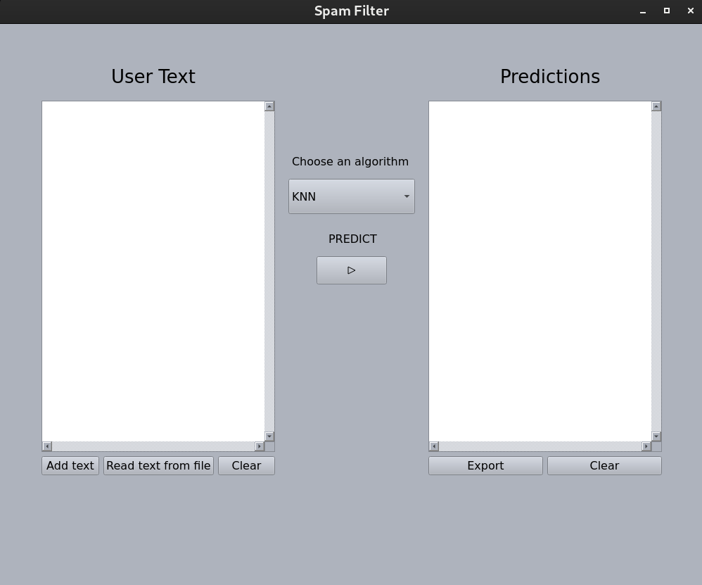
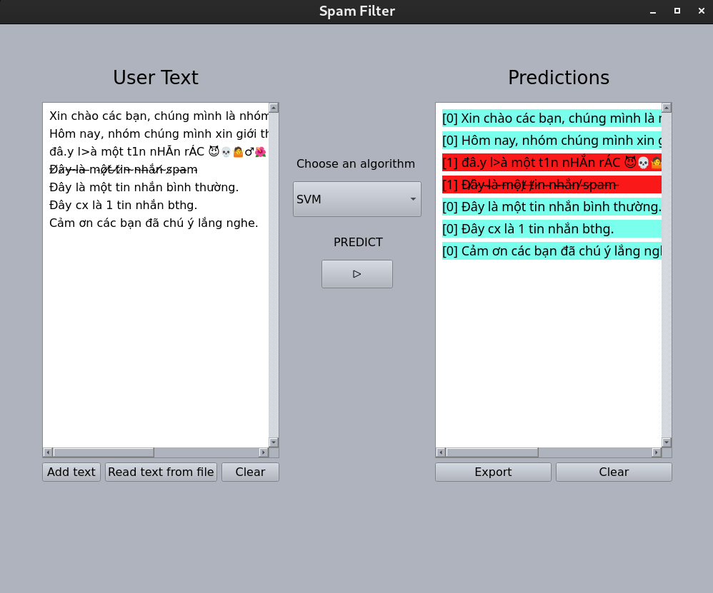

# Vietnamese-Spam-Detection 

## Table of Contents
* [Vietnamese-Spam-Detection](#vietnamese-spam-detection)
	* [About](#about)
	* [Installation](#installation)
	* [Usage](#usage)

## About 

This package contains code for spam detection in the Vietnamese language. It includes machine learning models trained on Vietnamese text data to classify messages as spam or non-spam. Additionally, it provides a user-friendly UI application built using the `PyQt6` library for demonstration and testing purposes.

## Installation 

To use this package, follow these steps:

1. Clone the repository: `git clone https://github.com/ankhanhtran02/Vietnamese-Spam-Detection.git`
2. Navigate to the project directory: `cd Vietnamese-Spam-Detection`
3. Install dependencies: `pip install -r requirements.txt`

## Usage 

### Running the UI App

To run the UI app for demonstration:

1. Ensure you have completed the installation steps.
2. Run the following command: `python main.py`
3. On the left side of the newly created window, you will see a text box which will contain the messages you want to classify. In order to classify new text messages, you can use the **Add text** and **Read text from file** buttons, after that, please press the **PREDICT** button in the middle. The output will appear on the right side of the app window. Messages classified as non-spams will be appended with the string `"[0]"` and have blue color, while spam messages will be appended with `"[1]"` and have red color. You can use our prepared text files contained in the demos folder. The algorithm used in making predictions can also be switched using the **Choose your algorithm** combobox.
	* You should see a window like this pop up when first running the application:

	* After you have chosen a file or added some messages yourself and pushed the PREDICT button, a result like this will be shown:

